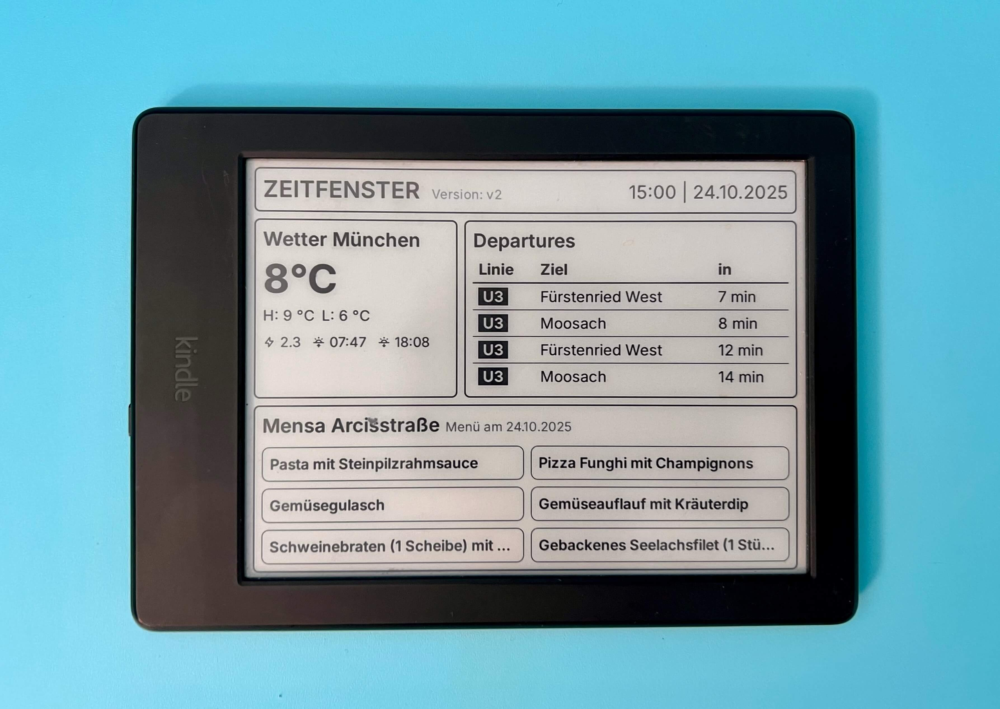

# ZEITFENSTER v2



> A calm, monochrome dashboard for people who love tidy status boards, not cluttered tabs.

## Table of Contents
- [Why ZEITFENSTER?](#why-zeitfenster)
- [Feature Tour](#feature-tour)
- [Architecture at a Glance](#architecture-at-a-glance)
- [Prerequisites](#prerequisites)
- [Local Development Walkthrough](#local-development-walkthrough)
- [Configuration Cheat Sheet](#configuration-cheat-sheet)
- [Setup Wizard Flow](#setup-wizard-flow)
- [Image Endpoint Cheat Sheet](#image-endpoint-cheat-sheet)
- [Deploying to Heroku](#deploying-to-heroku)
- [Kindle Dashboard Guide](#kindle-dashboard-guide)

## Why ZEITFENSTER?

ZEITFENSTER is a Flask-powered dashboard that combines:
- Live MVG departures tailored to your commute
- Open-Meteo weather for the station you care about
- TUM Eat API canteen menus with graceful fallback logic
- A Kindle-friendly screenshot endpoint that keeps a calm grayscale aesthetic

The app keeps dependencies small, ships without JavaScript build steps, and provides a setup wizard so new users get a tuned dashboard (and pre-built Kindle links) in under a minute.

## Feature Tour
- Guided, multi-step signup: welcome → transport → canteen, with validation and URL persistence.
- Dashboard tiles: top banner with live time/date, compact weather, departures table with filtering, and canteen dishes that switch to tomorrow’s menu after 14:00.
- `/image-push.png` endpoint renders an 8-bit grayscale PNG with optional scale controls and orientation hints.
- In-memory caching for menu, weather, and rendered images to keep responses snappy.
- Playwright automation bundled into the Flask app (no separate worker needed).

## Architecture at a Glance
```
app.py             # Flask entrypoint, routes, and Kindle renderer logic
templates/         # Jinja templates for dashboard, tiles, and setup wizard
static/styles.css  # Shared styling (designed for web + e-ink)
canteen_data.py    # Menu fetching with caching and fallback days
transport.py       # MVG departures + coordinate helper
weather.py         # Weather data with station-based geo lookup
config.py          # Minimal defaults (fallback canteen)
Procfile           # Production command (Gunicorn + Playwright bootstrap)
Aptfile            # System libs for Chromium when deploying on Heroku
```

## Prerequisites
- Python 3.10 or newer
- pip
- Playwright with Chromium browsers (installed per project)
- Git (optional, for cloning)

No Node toolchain is required.

## Local Development Walkthrough
1. **Clone and enter the project**
   ```bash
   git clone <repo-url>
   cd campusConnect  # or the directory you chose
   ```
2. **Create and activate a virtual environment**
   ```bash
   python3 -m venv .venv
   source .venv/bin/activate
   ```
3. **Install Python dependencies**
   ```bash
   pip install -r requirements.txt
   ```
4. **Install the Playwright Chromium browser once**
   ```bash
   python -m playwright install chromium
   ```
5. **Run the application**
   ```bash
   python app.py
   ```
   The dashboard is available at `http://127.0.0.1:5000`.
6. **Use the setup wizard**
   - Step 1: click “Let’s go”.
   - Step 2: search your station, pick transport types, adjust limit and offset.
   - Step 3: choose a canteen, decide whether to show prices, then:
     - Click **Take me to the dashboard** to save choices.
     - Use the **Image Endpoint** buttons to open Kindle-ready URLs in new tabs.

> Tip: rerun step 5 after dependency updates to ensure the app boots cleanly.

## Configuration Cheat Sheet

### Environment variables
- `IMAGE_PUSH_TOKEN` _(optional)_: require `?token=...` on `/image-push.png`.

### URL parameters understood by `/`
| Parameter    | Purpose                                             | Example                         |
|--------------|-----------------------------------------------------|---------------------------------|
| `station`    | MVG station search string                           | `station=Universität, München`  |
| `types`      | Comma list of transport filters (`UBAHN,SBAHN,...`) | `types=UBAHN,TRAM`              |
| `limit`      | Number of departures to render                      | `limit=4`                       |
| `offset`     | Minutes to shift departures (walk time)             | `offset=3`                      |
| `canteen`    | TUM Eat canteen key                                 | `canteen=mensa-garching`        |
| `show_prices`| Toggle canteen price column                         | `show_prices=0`                 |

Missing `station` or `canteen` automatically triggers the setup wizard.

## Setup Wizard Flow
1. **Welcome**: quick intro and CTA.
2. **Transportation**:
   - Full-text MVG station search with debounced results.
   - Choose transport types, departure count, and optional offset.
   - Validation prevents moving on without a station.
3. **Canteen & finish**:
   - Fetches canteen list live.
   - “Take me to the dashboard” redirects with all query params applied.
   - Two secondary buttons open `/image-push.png` in landscape or portrait orientation using the same parameters.
   - A simple “Back” link lets you tweak transport settings again.

## Image Endpoint Cheat Sheet
- Route: `/image-push.png`
- Recognized parameters (in addition to the dashboard ones above):
  - `orientation`: `portrait` (600x800) or `landscape` (renders landscape, rotates to portrait delivery).
  - `scale` or `zoom`: float between 0.5 and 1.5 to control virtual viewport size.
  - `cache`: set to `0` to bypass the 30-second in-memory cache.
  - `token`: required if `IMAGE_PUSH_TOKEN` is set.
- Response headers report render metadata (`X-Viewport`, `X-Scale`, `X-Render-Viewport`, `X-URL`).
- Emoji stripping and grayscale conversion happen automatically for e-ink clarity.

## Deploying to Heroku
1. Set the app stack to `heroku-24`.
2. Configure buildpacks (order matters):
   1. `heroku-community/apt`
   2. `heroku/python`
3. Deploy the repo; Heroku uses the supplied `Procfile`:
   ```
   web: sh -c "python -m playwright install chromium && gunicorn app:app"
   ```
4. Ensure the `Aptfile` is present (Chromium system dependencies for Playwright).
5. Optionally set `IMAGE_PUSH_TOKEN` via Heroku config vars for protected image access.

## Kindle Dashboard Guide

### Why an e-ink display?
- Non-intrusive status board that blends into the environment.
- Always-on glanceable info without glowing in your face.
- Let’s be honest: a Kindle on the wall running your dashboard just looks cool.

### Before you start
1. **Jailbreak your Kindle** following the instructions at [kindlemodding.org/jailbreaking](https://kindlemodding.org/jailbreaking/). This is required to run custom scripts.
2. **Install the USBNetwork mod** so you can SSH into the device.
3. Complete the setup wizard inside ZEITFENSTER and click one of the “Image Endpoint” buttons to obtain the PNG URL you want the Kindle to fetch (landscape or portrait).

### Connect to the Kindle
```bash
ssh root@192.168.15.244
```
(Replace the IP if your Kindle uses a different address.)

### Prepare the device
1. Remount the root filesystem read-write:
   ```bash
   mntroot rw
   ```
2. Create the URL file **before** loading scripts:
   ```bash
   echo 'https://your-image-endpoint-url-here' > /mnt/us/url.txt
   ```
   This `url.txt` should contain the first line produced by the wizard’s image button.

### Install the updater script (1-minute refresh, no anti-ghosting)
```bash
cat > /mnt/us/script.sh <<'SH'
#!/bin/sh
# Minimal Kindle dashboard updater (no anti-ghosting)
PATH=/usr/bin:/bin:/usr/sbin:/sbin

URL="$(/bin/busybox head -n1 /mnt/us/url.txt 2>/dev/null)"
[ -z "$URL" ] && exit 0

IMG='/mnt/us/status.png'
TMP="${IMG}.tmp"
HDR='/tmp/kdash.hdr'

# Try up to 3 times; only accept 200 OK; keep old image otherwise
for i in 1 2 3; do
  if /usr/bin/curl -sSL -D "$HDR" --connect-timeout 8 --max-time 20 "$URL" -o "$TMP"; then
    CODE="$(/bin/busybox grep -i '^HTTP/' "$HDR" | /bin/busybox tail -n1 | /bin/busybox awk '{print $2}')"
    if [ "$CODE" = "200" ]; then
      /bin/mv "$TMP" "$IMG"
      /usr/sbin/eips -g "$IMG"    # seamless partial update
      exit 0
    else
      /bin/rm -f "$TMP"; /bin/sleep 2
    fi
  else
    /bin/rm -f "$TMP"; /bin/sleep 2
  fi
done
exit 0
SH
chmod +x /mnt/us/script.sh
```

### Add the anti-ghosting helper (every 5 minutes)
```bash
cat > /mnt/us/antighost.sh <<'SH'
#!/bin/sh
# Kindle anti-ghosting pass (5-minute cron)
PATH=/usr/bin:/bin:/usr/sbin:/sbin
IMG='/mnt/us/status.png'

# Strong built-in wipe, then redraw current image
/usr/sbin/eips -c; /usr/sbin/eips -c; /usr/sbin/eips -f
[ -f "$IMG" ] && /usr/sbin/eips -g "$IMG" -w gc16 -f

# Immediately retrigger fetch+draw (runs in background to avoid blocking)
/mnt/us/script.sh &
exit 0
SH
chmod +x /mnt/us/antighost.sh
```

### Test both scripts once
```bash
/mnt/us/script.sh
/mnt/us/antighost.sh
```
If you see the dashboard on-screen, you are ready for automation.

### Schedule the jobs (cron)
```bash
grep -q '/mnt/us/script.sh' /etc/crontab/root || printf '%s\n' '* * * * * /mnt/us/script.sh >/dev/null 2>&1' >> /etc/crontab/root
grep -q '/mnt/us/antighost.sh' /etc/crontab/root || printf '%s\n' '*/5 * * * * /mnt/us/antighost.sh >/dev/null 2>&1' >> /etc/crontab/root
kill -HUP "$(pidof crond)" 2>/dev/null || /usr/sbin/crond -b
```

### Optional: keep the Kindle awake
```bash
lipc-set-prop com.lab126.powerd preventScreenSaver 1
```

### Updating the image URL later
Whenever you generate a new endpoint (for example, switching orientation or canteen), update the file and retrigger a fetch:
```bash
echo 'https://your-new-url-here' > /mnt/us/url.txt && /mnt/us/script.sh
```

After finishing configuration you can remount read-only again if desired:
```bash
mntroot ro
```

Enjoy your always-on dashboard! The combination of minute-by-minute refreshes and the five-minute anti-ghosting sweep keeps the Kindle crisp without wearing out the display.
